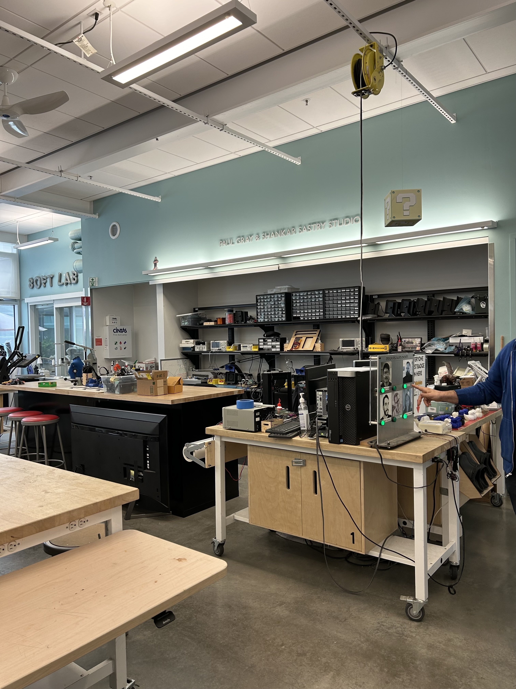

# Hello DES INV 202 Student!
Welcome to your new GitHub repository! 

# Outline
[week 1](README.md#week-1-Intro-to-TDF)

week 2, etc...

---

# Github Background Information & Context
If you’re new to GitHub, you can think of this as a shared file space (like a Google Drive folder, or a like a USB drive that’s hosted online.) 

This is your space to store project files, videos, PDFs, notes, images, etc., and (hopefully, neatly) organize so it's easy for viewers (and you!) to navigate. That said, it’s super easy for you to share any file or folder with us (your TDF instructional team) - just send us the link!  As a start, feel free to simply add images to the `/assets` folder, which is located [here](/assets). 

The specific file that I’m typing into right now is the **README.md** for this repo. 
##### (💡 TIP: The .md indicates that we’re using [Markdown formatting.](https://www.markdownguide.org/cheat-sheet/)) #####
<h6> (💡 TIP 2: GitHub Markdown supports <a href="https://gist.github.com/seanh/13a93686bf4c2cb16e658b3cf96807f2"> <em>HTML formatting</em> too, including emojis 😄</a>, in case that helps!) </h6>

### :star: Whatever you write in your **README.md** will show up on the “front page” of your GitHub repo. This is where we’ll be looking for your [weekly progress reports](https://github.com/Berkeley-MDes/24f-desinv-202/wiki/3.0-Weekly-Submissions#weekly-progress-report). They might look something like this: ###

# Week 1: Intro to TDF #
## Week of 08/29/2024

This week is the first week of school. I took my first TDF class in the MDes program and was introduced to many new tools and new concepts. I learned about the skills required for this class, the projects we are going to work on (including the levels of expectation), the tools that we will learn (Rhino, Grasshopper, Particle IDE, etc). I explored each tool for a bit after I got home to get a basic sense of what these are like. For now, I am both excited and concerned about moving forward with new tools to learn. I am looking forward to trying out new things and expand my skill set. I also really want to see my creations come into life. I am a bit concerned about how steep the learning curve is going to get for these platforms, especially for Rhino. Given that I have 0 experience in this area, I might need to really spend much time on becoming familiar with such softwares. 

Apart from that, I opened up my github account and completed some trainings for using the equioments at Jacobs. Still trying to familiarize myself with the new environment and new workflow at Berkeley.

 

My speculation for the coming weeks is pretty optimistic. For the tools being used in the TDF class, I expect them to be accessible and easier to use as I engage with them over time. I don't really expect tools to evolve or we change tools over this semester, but I am willing to learn about what tools can help with the product design/software learning process. There wasn't any work done this week. I expect to try out the machines in the studio more often, and expect to create products of high quality. For projects that I am not familiar with, I expect to make something that reflects my maximal effort. 

*I found an article about digital ecosystem and I feel like it ties to our second project. Creating open platforms for sharing and collaboration is definitely a future trend and therefore I think our 2nd project will equip me sufficient skills to get ready for the future.

[Link to article](https://www.reuters.com/technology/google-meta-qualcomm-team-up-push-open-digital-ecosystems-2023-12-13/)

---

# Week 1: Example Report 1 #
## Week of 09/05/2024

This week, I designed a cool phone stand made of rocks. Check out all my cool sketches and progress photos from this week below, etc., etc....

---

It's time to start making this space your own! If you want to save these instructions, make a copy.  Also, feel empowered to delete everything in this README.md and start documenting! 

Excited to work with you,
your TDF teaching team

PS: let us know if you have any questions!!

PPS: 

## Quick Links, compiled here for your convenience: ##

- [TDF Wiki](https://github.com/Berkeley-MDes/24f-desinv-202/wiki) - the ultimate source for truth and information about the course and assignments
- [Google Drive Folder](https://drive.google.com/drive/u/0/folders/1DJ1b6sSDwHXX6NRcQYt10ivyQSgU0ND6) - slides and other resources
- [bCourses](https://bcourses.berkeley.edu/courses/1537533) - where the grading happens
