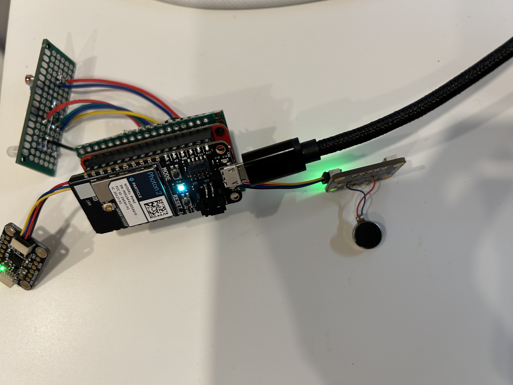
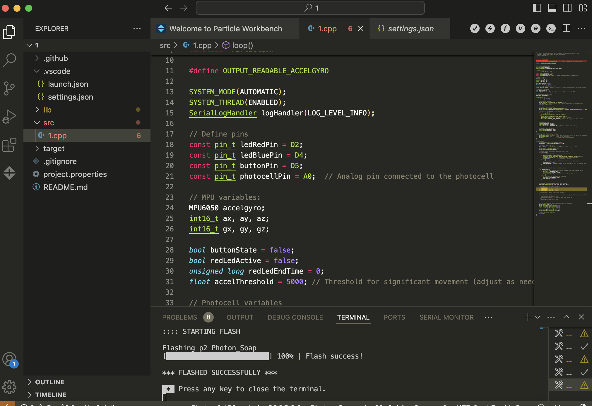
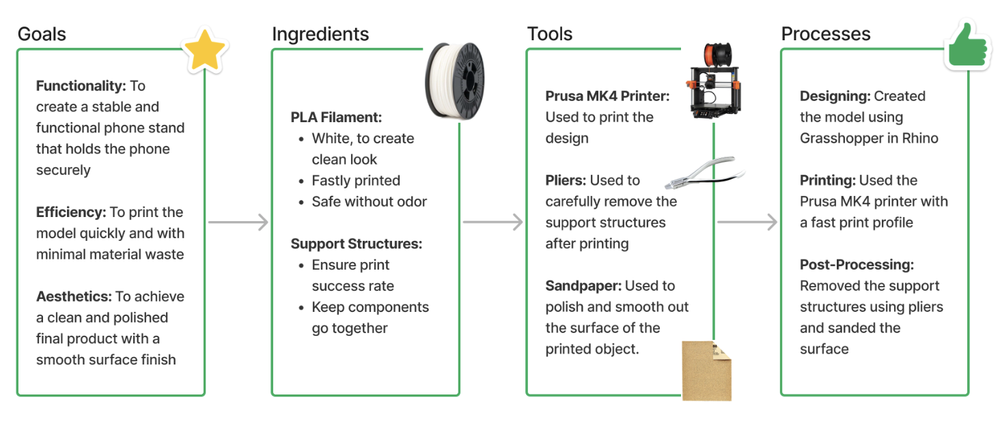
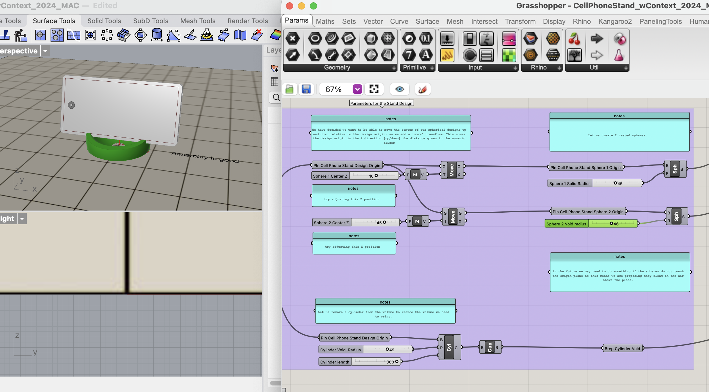

# DES INV 202 Journal
Welcome to my new GitHub repository! 

# Outline

[week 12](README.md#week-12-AblePay-Project)

[week 11](README.md#week-11-Final-Project-Prep)

[week 10](README.md#week-10-Designing-my-LLM-Project)

[week 9](README.md#week-9-Starting-LLM-Project)

[week 8](README.md#week-8-Finish-Rememberall-Project)

[week 7](README.md#week-7-Rememberall-Project)

[week 6](README.md#week-6-Building-Ecosystem)

[week 5](README.md#week-5-Learning-about-Particle-Photon-2)

[week 4](README.md#week-4-Starting-new-project)

[week 3](README.md#week-3-Building-my-own-phone-stand)

[week 2](README.md#week-2-Trying-Rhino-and-grasshopper)

[week 1](README.md#week-1-Intro-to-TDF)

---
# Week 12: AblePay Project #
## Week of 11/14/2024

### What I've done

This week, I focused on advancing the design and research components of the credit card microcontroller project. Specifically:
Prototyping: I explored different microcontroller options, comparing their size, power consumption, and compatibility with OLED screens. I settled on one that balances functionality and portability.
Researching Accessibility Features: I delved into the needs of individuals with limited hand mobility, examining existing assistive technologies to inform the design. This included brainstorming how Braille overlays and tactile feedback could be effectively integrated.
Developing Feedback Mechanisms: I began outlining vibration patterns and their corresponding states, such as CVV updates or payment confirmations.
Proximity Detection Experimentation: I tested basic proximity sensors to determine their feasibility for auto-deactivating the CVV display when the card moves beyond a specified range from the user’s phone.

### Reflection

This week has been a balance of technical and empathetic design thinking. I’ve made significant progress in selecting components, but it’s clear that combining functionality with accessibility is a complex challenge. Prototyping helped clarify technical constraints, but it also underscored the need for further testing with real users to ensure the design serves its intended audience effectively.

I also noticed the importance of iterative design—initial ideas for the Braille overlay felt static and disconnected from the digital feedback mechanisms. This reinforced the need to align tactile and auditory feedback for a seamless user experience. Finally, testing proximity sensors highlighted potential issues with sensitivity and range, which I’ll need to refine.

### Speculations

Looking ahead, I anticipate needing to tackle a few key challenges:

Accessibility-Driven Iterations: While I’ve identified potential solutions, such as vibration feedback and Braille overlays, I suspect user testing will reveal unexpected accessibility barriers. I plan to recruit participants with diverse needs for usability testing soon.
Integration Complexity: Merging the OLED display, microcontroller, and feedback mechanisms into a compact, seamless design will require creative problem-solving. I might explore modular designs as a way to simplify integration.
Proximity Sensor Calibration: I need to experiment further with proximity-based deactivation to ensure it’s reliable in real-world settings. This might involve testing different sensor technologies or adjusting thresholds dynamically based on user feedback.

By the end of next week, I aim to finalize the hardware prototype and conduct initial testing to validate my design choices. This will set the stage for refining both the technical and experiential aspects of the product.

---
# Week 11: Final Project Prep #
## Week of 11/07/2024

### What I've done

Research: This week, I focused on identifying the ideal components for a pigeon-deterrent product that can detect pigeons approaching my balcony, emit ultrasonic sounds to deter them, and log the daily pigeon count. My research involved comparing different types of sensors to find the most effective solutions.

Motion Detection Sensors: I compared the LV-EZ1 Maxbotix Ultrasonic Range Finder and Sharp IR distance sensor. Through this, I evaluated the strengths and limitations of ultrasonic vs. infrared detection in outdoor environments, particularly regarding color sensitivity and range.

Light Sensors: To distinguish between day and night for the ultrasonic noise function, I examined various light sensors, ultimately selecting the BH1750 ambient light sensor for its high accuracy in outdoor settings.

Component Orders: Based on the research, I ordered key components to start prototyping, including the ultrasonic sensor, light sensor, servo motors, and display screen.

Image of my list of items that I ordered:

### Reflections

Reflecting on the research process, I found that each component choice involved balancing simplicity with functionality. The ultrasonic sensor stood out for its ability to detect pigeons without being influenced by color or light, which could make it more reliable than other sensors like IR. However, I also considered that ultrasonic sensors might be sensitive to environmental conditions like temperature or wind, which could affect their performance. Choosing the BH1750 ambient light sensor over a simpler photocell also reflected a focus on accuracy—by distinguishing day from night precisely, the product could avoid false triggers, especially around dawn or dusk. I think these decisions will help create a more stable and responsive product, even if it adds slight complexity to the setup.

Another reflection is on the overall setup’s user experience. My goal is for the product to operate autonomously without much user intervention, and this week’s component choices aligned well with that vision. I want to design a system that feels smart enough to adapt to its environment and carry out its functions smoothly, which has guided my focus on more precise, reliable components.

Here's a diagram for considering design for a small electronic item:

### Speculations

Looking ahead, I have several speculations about how these components will perform together and the adjustments that might be needed. For instance, I’m curious about the ultrasonic sound's effectiveness in actually deterring pigeons. Although ultrasonic frequencies are often recommended for pest control, pigeons may react differently, so I anticipate experimenting with a range of frequencies to find the most effective deterrent.

Another speculation involves the complexity of integration. Combining real-time data from sensors with motor controls and sound emission could present challenges, especially in managing timing and power needs for each action. I may need to test various microcontroller configurations to ensure the system runs smoothly without lag.

Additionally, I’m considering the possibility of future enhancements, such as remote monitoring to track pigeon counts or even adjust settings via a smartphone. If the initial prototype works well, adding a cloud component could offer even greater value by allowing users to check status or make adjustments on the go.

--- 
# Week 10: Designing my LLM Project #
## Week of 10/31/2024

### What I've done

This week, I started design my own flow for interacting with a LLM. To make my digital twin to answer questions about my project experiences during TDF, I imported my weekly reports and project reports as knowledge base. I also used GPT 4-o to parse the information and generate desirable results.

One thing that I added was to add DALL-E to my flow to generate an image for users. They can better understand how my projects look like with a generated image. 

Here are the interesting responses of my experiments:

Here are some nice answers from my own flow (with image generation):

I asked GPT to create images for my favorite design and to envision my next design.

&nbsp;

Here is a diagram of how I visualized to process of creating flows.

### Reflections

This week’s experience designing my own flow for interacting with an LLM has shown me the power of combining personalized information with advanced AI tools. By creating a knowledge base from my weekly and project reports, I was able to generate answers that reflect my project experiences, making the digital twin truly personal and relevant. Adding DALL-E to the flow was a unique addition, as it provided a visual dimension to my responses, allowing users to better connect with my projects through generated images. This integration highlighted how AI can be a comprehensive tool, not only for answering questions but also for creating visuals that deepen understanding. These experiments have sparked ideas about how I can further refine this system to make it an even more interactive and engaging resource.

### Speculations

I made speculations based on human experiences, engineering, and role of AI. 

--- 
# Week 9: Starting LLM Project #
## Week of 10/23/2024

### What I've done

This week, I wrapped up everything for the previous project and started a new one. It is my first time engaging with LLMs. I followed tutorials for the zero width platform. It is similar to Grasshopper as I also uses diagrams to code and design.

1. Tutorial 1 with a simple gpt agent
   

2. Tutorial 2 with instructions. I changed it to be about my experiences as a designer and researcher.
   

3. Tutorial 3 with knowledge base. I put in my weekly reports and project reports.

4. Tutorial 4 with variables. I used Skills and Week as my variables to specify what I used during which week.
   

Here is  diagram of how this thing works, I think it is really helpful.

### Reflections

Engaging with LLMs for the first time has been an intuitive process thanks to my background with Grasshopper, where diagrammatic thinking plays a key role. The tutorials on the Zero Width Platform allowed me to explore how to shape the model’s responses based on my own design and research experiences. Building a knowledge base from my weekly and project reports was especially enlightening, as it showcased the LLM’s potential to organize and recall personal insights. This experience has inspired new ideas for using LLMs as reflective tools that could grow alongside my projects and professional development.

### Speculations

Moving forward, I can envision scaling these applications of LLMs to build multi-project or even team-based knowledge bases, where insights from one project could inform another. The concept of an LLM as a digital twin that can capture and reflect my evolving design thinking opens up exciting possibilities, especially for collaborative work. This would be particularly powerful in future career settings, where an LLM could serve as an adaptive assistant—suggesting relevant past experiences or design tools to support ongoing challenges and projects.

---
# Week 8: Finish Rememberall Project #
## Week of 10/16/2024

### What I've done

This week, our group made significant progress on the Remembrall project by focusing on key areas: integrating code, fabricating the outer shell, and documenting our design process in a video.

**Personal Diagrams**

I included a diagram that highlights my role in the project.

**Code Integration:**

We worked extensively on incorporating the Google Calendar API into the project. Our goal is to sync the device with users' calendars to provide timely alerts for upcoming events. I helped refine the input-response system, ensuring that different actions, such as pressing a button or shaking the device, triggered the correct responses—lighting up for a reminder or alerting others in a group scenario.
We also ensured that the hardware components, like sensors and circuits, were correctly coded to detect when the device was shaken or pressed. This required several iterations of testing the sensor responses and refining the code for smoother interaction.

 

**Fabricating the Outer Shell:**

One of our key milestones this week was successfully fabricating the outer shell of Remembrall using 3D printing. We designed the shell to be aesthetically pleasing while also housing all the necessary electronics in a compact form. We focused on ensuring the design was functional, allowing easy access to the buttons and sensors without compromising the sleek look of the device.
I was heavily involved in the design and fabrication process—iterating on the 3D model to make sure it fit our circuits snugly while remaining lightweight and ergonomic. The 3D printing process required several adjustments to get the right fit, but we were able to produce a high-quality shell that works well for our prototype.

**Video Showcase:**

To document our progress and present our design, we created a video showcasing the Remembrall. The video highlights key user scenarios, including running to a late meeting, relaxing at home, and group reminder situations. We also demonstrated how the device reacts to different inputs (e.g., shaking, button presses) and incorporated shots of the fabrication process, including coding, circuit assembly, and 3D printing the shell.

I helped script the scenarios, film the interactions, and edit the footage to produce a cohesive narrative that reflects the potential use cases of Remembrall. The video serves as an important tool for communicating our design concept and technical achievements to our peers and stakeholders.

### Reflections

This week, the focus on coding and ensuring smooth interaction design was both challenging and rewarding. One major takeaway was learning how to effectively map user inputs (shaking, pressing buttons) to meaningful outputs (lights, haptic feedback) while integrating third-party APIs like Google Calendar. The complexity of working with both hardware and software became evident as we had to constantly debug and refine our code to ensure the sensors were responsive.

The 3D printing process also brought up interesting design considerations—how to balance aesthetics with functionality. We had to ensure the shell wasn’t just visually appealing but also practical for housing all the electronics securely. I learned a lot about the importance of iteration in both coding and physical design, as we had to adjust our prototypes and models multiple times to get everything right.

  
### Speculations 

In the future, our focus will be on finalizing the integration of Google Calendar data into Remembrall’s interaction flow. We need to ensure that real-time event notifications are reliable and that the lighting and haptic feedback correspond to calendar events in a way that is intuitive for users.

I also want to continue improving the physical design by further refining the 3D-printed shell. It needs to be optimized for long-term use—lightweight, durable, and easy to carry or place on a desk. There are still some adjustments needed to make the device more comfortable to hold and use.

We plan to incorporate more advanced sensors for detecting user interaction more precisely. For example, adding proximity sensors or enhancing the shake detection could provide users with more dynamic ways of interacting with Remembrall.

Additionally, we will focus on creating more polished, user-centric scenarios, demonstrating the device in real-life situations and ensuring that the interaction design truly meets the needs of busy professionals.

---
# Week 7: Rememberall Project #
## Week of 10/10/2024

### What I've done

This week, I formed a group with Aarya and Vivian. Together, we plan to work on creating a ball like product that glows according to google calendar API. I am in charge of building the circuit and creating the code for the simulation of the hardware. I started little by little by adding the components to the circuit one by one and test them. Then I integrate the code to accomodate more diverse needs.

Here is our inspiration:

 

Here are pictures and videos of the circuit:

 

  

Here are the codes that I have tried, one by one:

  

Here is a diagrams we created better understand the project:

 

### Reflections

What's good is that I think I have created the circuit very fast and tested incrementally to deepen my understanding and enhance my design. I enjoyed working with Aarya and Vivian since they are really helpful when I meet difficulties and they did really great in their tasks. I was facinated my the Google API call functions. I wish I could spend more time to explore the functionalities of photon, since it is very powerful. 

### Speculations

For next week, we plan to finish the project early and think about how to shoot the video. Also, fabrication of a good appearance is a big challenge to us. Since the ball is small, I speculate that we might change our circuit for a bit. In the future, I think I will engage more in designing such products and explore the possibilities of creating small, smart things within our large ecosystem.

---

# Week 6: Building Ecosystem #
## Week of 10/03/2024

### What I've done

This week, my focus was on connecting a Stemma QT interface board to the Particle Photon and exploring some sensor projects. After soldering the board, I downloaded the project files and set them up in Visual Studio Code using the Particle extension. Getting everything configured for my device was pretty simple.

Working with the accel/gyro component and the MPU6050 was pretty fascinating. It’s amazing how much information you can get from such a small sensor—detecting motion, tilt, and orientation. Seeing those raw values streaming in real time felt like I was directly tapping into the physical movements of the device. It made me think about the possibilities of using these values to make more interactive and responsive designs. Even though the data can be a little unpredictable and noisy, there’s something satisfying about experimenting with different ways to clean it up and make it more usable.

  

Integrating the MPU6050 into smart products seems like it has huge potential. It could be the core of a product that reacts to user movements—like a wearable that tracks fitness or an IoT device that adjusts based on its orientation. The idea of combining it with the Particle ecosystem is especially exciting because it means the data could be sent to the cloud and interact with other devices in real time. It’s easy to see how this could be used in all kinds of projects, from games to practical tools, and it made me excited about what else I could build with it.

  

I wanted to push it a bit further, so I explored using the `map()` function to control an LED with the sensor values. To understand the data better, I printed it to the Serial Monitor with `Log()`, and found that the readings were a little noisy. I used `constrain()` to keep the values within a set range and considered adding a moving average to smooth things out.

I also wanted to see how I could share the sensor data with other devices. Using `Particle.publish()` and `Particle.subscribe()`, I managed to get the data from one device to another, which could be a fun way to collaborate with classmates or build interactive projects. This week’s experiments helped me get a better feel for tweaking firmware and working with sensor data, and I’m excited to dive deeper next week.

I also formed a group with Aarya and Vivian to built our digital ecosystem. Our idea was to create a ball/bulb that lights up depending on user's google calendar status. We will utilize google's API, particle cloud, LEDs, and various hardware components to build this project. 

*This is how we imagine our system to behave*

 

*This is our user flow*

 
  

### Reflections

This week’s work gave me a lot to reflect on, especially regarding the process of connecting hardware components with digital data streams. Experimenting with the MPU6050 and seeing how raw motion data can directly influence physical outputs, like an LED, really highlighted the potential of combining sensors with real-time data processing. It made me think more deeply about the importance of smoothing out data to make it reliable and useful for real-world applications. There’s something rewarding about overcoming those challenges, like managing noisy data, to make a more refined and responsive system. It’s also satisfying to see how a small change in code can have an immediate impact on physical behavior.

### Speculations

Looking ahead, I am excited about how we can push our digital ecosystem project even further. The idea of using a Google Calendar to influence a tangible object like a light-up ball feels like just the beginning. There are many directions we could take with our calendar bulb project, making it more than just a simple light-up ball. One goal could be to fine-tune how the ball reacts to different types of events—like using different colors to indicate work meetings, personal appointments, or reminders. It could also change brightness based on the urgency or time until the next event, providing an at-a-glance way to understand the day's priorities without needing to check a screen. I can imagine expanding it into a system that not only reacts to calendar events but also uses other types of data inputs to shape user interactions. Maybe it could connect with other APIs or sync with multiple smart devices to create a fully connected environment. These experiments have shown me that with the right tools, it’s possible to bridge the digital and physical worlds in new and meaningful ways, which has me excited about what’s next.

---
# Week 5: Learning about Particle Photon 2 #
## Week of 09/26/2024

### What I've done

Documenting how I explored and learned about particle workbench and the photon2 board through going through initial tutorials.

1. I connected the board to my laptop and completed the setup on particle.io. By connecting my product to UCB's IOT and to my home wifi, I was able to configure the board.

  

&nbsp;

2. I flashed codes to my board to explore the serial monitor function, ensure connection settings are good, and see how my board reacts. Serial monitor successfully showed the desired messages that I want to see, including counting strings and printing out "hello world".

   

&nbsp;

3. I then went ahead to examine the particle photon 2 board diagram, and follow the picture to build the circuit out.

  

&nbsp;

4. I then setup a very basic circuit with an LED and a button. By flashing the code that allows control for the speed of blinking led with the button, I was able to control the led! Here's a gif about how the blink rate changes.

   

&nbsp;

5. The next step was to make some changes by myself. I first added an additional led light to the system. I added addtional code to the original file. Now, pressing the button can control the blinking speed of both lights. One goes faster and the other one goes slower. I made changes in the C script by adding the OUTPUT and addtional lines for the function that controls the button press.

   

   

&nbsp;

6. I also tried to add another button. Pressing them can control the blink of the led. One makes it faster and the other one makes it slower. I made changes in the C script by adding another INPUT and created an additional function that specifies what the additional button does.
   
   

   

&nbsp;

7. Last, I connected my device to cloud and tried to publish and track information to the cloud. This prepares me for future tasks that involves with communication with the cloud.

&nbsp;

**Discoveries, Thoughts**

*Challenges*

A key challenge was ensuring that the button press accurately controlled the LED's blinking period without delays or missed inputs. Debugging button responsiveness and dealing with timing issues in the code required careful adjustments, especially when the LED didn’t change its blinking behavior consistently.

*What is working?*

The button successfully changes the LED's blinking period when pressed, and the system responds promptly. The LED behavior is visually clear, and the timing adjustments from the button presses are working reliably after troubleshooting the timing logic.

*What is to be done?*

Further refinement could include ensuring the button press is debounced to avoid false triggering or unintended behavior. Improving the code to handle rapid presses and ensuring smooth transitions between blinking periods are additional goals for optimizing the interaction.

Here is a diagram of a good ecosystem representation:

**How the Elements Work Together to Create a Cohesive Whole:**

* Timing System: The timing system controls the LED blink rate, which changes based on the button presses. This provides real-time feedback, allowing the system to react to user input, making it dynamic and interactive.
* Variables: Variables such as pulserate store the current blinking speed, allowing the system to adjust based on button presses. This interaction makes the program adaptable, enabling both buttons to modify the behavior of the LEDs.
* Outputs: The LED illumination (both onboard and external) serves as visual feedback, reflecting changes based on your interactions. The onboard LED's behavior demonstrates the system’s functionality, while the external LED adds more visual elements, making the changes more noticeable.

**How This System Benefits a New Design**

* **Scalability:** The system can be expanded with additional inputs and outputs, making it ideal for more complex designs. For example, adding more buttons or LEDs to control different aspects of an interactive device.
* **Real-time Interactivity:** The system's responsiveness to button presses offers immediate feedback, which is crucial for designs requiring user interaction, such as lighting controls, alarms, or smart home devices.

**Entry Points and Advantages**

The system’s primary entry points are both hardware and software. The buttons serve as the hardware entry points, allowing users to interact directly with the system. The variables and timing logic act as the software entry points. This dual nature ensures that the system is highly responsive and can be adjusted or expanded as needed, making it versatile for different applications.

One of the key advantages of this system is its flexibility and adaptability. It’s easy to add more components, such as additional buttons or LEDs, which makes the design scalable. When cloud integration is enabled, it offers the added advantage of remote access and monitoring, expanding the system's capabilities further.

**Missing Ecosystems in Daily Life**

One missing ecosystem in my daily life is a smart notification system that offers visual cues based on real-time data. For example, an LED-based system that changes color or blink patterns to indicate notifications from various devices or apps would be extremely useful. It could provide non-intrusive, quick insights into important updates, such as incoming messages, weather alerts, or reminders, without needing to check multiple screens or devices constantly. Integrating a system like this into my workspace would streamline how I receive information and enhance overall productivity.

### The 3 Additional Tutorials I've done

**Button -> LED pulse rate**

This tutorial is similar to what we tried for the initial tutorials, so building the circuit and flashing the code was pretty fast. Here is the circuit I built, and here's a demo of how I controled the lights by pressing the button to make it fast, then reset.

   

**FSR -> LED color**

For the FSR tutorial, I built the circuit with a tape and then tested it by flashing code to it. I met some difficulties flashing the code because I entered the wrong setting to it. After fixing it, it worked well. As I applied pressure to the FSR, the led gradually changes its frequency.

   

**Button Send on change**

For this one, as it involves with the cloud, I reconnected my photon to ensure my device is online. I built this simple circuit and examined the code. I managed to see the status of button press on the cloud portal. 

  

   

### Reflections and speculations based on tutorials

The new demos introduce more complex inputs like the FSR, allowing for continuous, analog control, such as adjusting color fades in an RGB LED. Prior examples focused more on binary inputs, like buttons controlling the random blinking of LEDs, and simpler output behaviors. Both the new and prior examples involve real-time event handling, such as pressing a button to trigger changes in LED behavior. Additionally, both systems send data, whether it’s logging to a console or publishing values to the cloud, maintaining a shared focus on interactivity and feedback.

The demos could be expanded by adding sensor feedback, like temperature or light sensors that automatically adjust the RGB LED based on environmental conditions. Another idea is to implement varying button press durations to trigger different behaviors, so that we could add versatility to user interactions. A feature relevant to my life is the FSR one, like adjusting lighting or sending notifications based on sensor data. This could be useful in day-to-day activities, where the system adapts to environment without manual intervention.

Machine learning could analyze user interactions, learning preferences for button presses or sensor inputs. Over time, it could adjust LED behaviors or environmental settings automatically based on patterns, making the system more personalized and reducing the need for manual adjustments. These examples could be combined into a smart home ecosystem where button presses, sensor data, and cloud interactions control devices like lights, fans, or even notifications. Machine learning could unify the system, adapting settings based on user behavior and environmental inputs to create an intelligent, automated environment.

# Week 4: Starting new project #
## Week of 09/16/2024

### What I've done
This week, I finished my first project for grasshopper and started new project on digital ecosystem. Here is what I've done:
* presented my video to peers and gathered feedback for project 1
* created a report for project 1 to organize all my thoughts and summarize my work
* learned about digital ecosystems
* installed software and platform needed for project 2 development
* learned about expectations for project 2
* made a diagram about digital ecosystem on work/productivity

&nbsp;

Here are some documentations of what I have done:

**1. Summing up my first project**

For my last project, I received valuable feedback from peers during last week's peer review session. Many people appreciated the logical flow and explanation of the design process in the video. However, some people suggested that I should simplify codes, add transitions, and offer more explanations of the Grasshopper script. Most users also requested explanations of why a chair shape was chosen. I really value those suggestions and think that I will definitely take those in consideration when building my next project. Clarity, simplicity, and structure are all key elements to any design project. I also created diagrams for fabrication analysis and speculations when I made the report. Those were really helpful in my reflection process. I get to think thoroughly about the steps that I went through. I was able to think about what I did well and what part I want to do better. Here are the 2 diagrams I created.

*fabrication analysis*

&nbsp;

*my speculations*

**2. Learning about digital ecosystem and installing software**

A digital ecosystem can be viewed as a unified whole formed by the interaction of digital elements functioning within a complex environment. Key entry points into this ecosystem include microcontrollers (e.g., Photon2), firmware code, electronics, and web-based interfaces, all of which facilitate human-computer interaction (HCI) and bridge physical computing with digital interfaces. Examples of digital ecosystems range from rapid prototyping and IoT devices to interactive art, gaming, simulations, remote interfaces, and cloud computing. Microcontrollers are highlighted as small computers with components like a CPU, system clock, memory, and peripherals, utilizing input/output pins and pulse width modulation for signal variation. Our project challenge involves designing a system that demonstrates interconnected behavior across these entry points. 

*I installed the required platform and searched it up for a bit*

**3. Creating a diagram about my understanding of digital ecosystems**

Based on my understanding of digital ecosystems, I created a map for my work and productivity scheme. I broke the products I use into 3 categories - devices, tools, and supporting services. For the inner circle, the labels show how each function supports each other. For the outer circle, I labeled the information that each category transfers and displays. And for the connections of the outer circle, I used them to complete the feedback loop. I wrote about how they influence user(my) behavior and make an effect on future behaviors.

### Reflections

Completing my first Grasshopper project and transitioning to the digital ecosystem project has been a transformative experience. Beyond the peer feedback, the most valuable part was the chance to deeply analyze my design process. Creating diagrams for fabrication analysis and speculations allowed me to see how each step contributed to the final product. This reflection made me more aware of the importance of a methodical approach, showing how every decision impacts the overall outcome. I realized that design isn't just about making something functional or aesthetically pleasing; it's about understanding the journey and the thought process behind it. This insight has reinforced my belief that great design emerges from an intentional and iterative process that embraces both successes and areas of improvement.

### Speculations

Looking ahead, I see myself approaching design with a more holistic mindset, especially as I delve deeper into the digital ecosystem project. Understanding how interconnected elements like microcontrollers, firmware, electronics, and web interfaces shape user experiences has made me more conscious of the complexity and potential of digital design. I plan to create systems that are not just functional but adaptable, responsive, and capable of evolving alongside user behaviors and technological advances. 

My view of the design world is shifting toward seeing it as a living ecosystem where every element has a role and an impact. In the future, I want to create designs that go beyond isolated functions, integrating multiple entry points to form a cohesive, interactive experience. I believe that truly innovative design comes from recognizing patterns, connections, and influences within this digital landscape. This awareness will guide me to design with empathy, adaptability, and a strong sense of purpose. As I continue my journey, I aim to blend technical stuff with a deep understanding of human experiences.

---
# Week 3: Building my own phone stand #
## Week of 09/09/2024

### What I've done
This week, I finished my initial explorations on grasshopper and started to build my own phone stand for our first assignment. In order to get prepared and make the project look good, I completed the following:
* watched linkedin tutorials and youtube on grasshopper's basic use and navigation
* looked for forms that suit my current ability of parametric design + determine what I'm gonna do
* ask GPT about techniques specific to my design
* consult technologist at the makerspace about fabrication
* 3D print my design
* Test my design

&nbsp;

Here are some documentations of what I have done:

**1. Determining what I'm gonna make**

The first challenge I met this week was I need to decide what I'm gonna create for the first assignment. After playing around with the phone stand file provided to us, I feel like there are a lot of elements worth exploring for phone stands -- stability, orientation, form, size, appearance, etc. Therefore, I decided to still create a phone stand. I wanted to create something that is compact, cute in its form, not so hard in its parametric form, and have the ability to be adjusted. I looked online and found some ones that matched my expectations and I selected the last pic as my inspiration. I selected it because the shape of the chair is a collection of cylinders and boxes, which look familiar to me, while they have a much harder combination than the initial design showed to us. Also, it looks cute and has 3 levels of inclination to be adjusted by users.

⬅️*Selected*

&nbsp;

**2. Planning and learning**

I started by asking GPT for advice on the components I would need. After gathering the information, I sketched out the form, envisioning how the chair would look and function as a phone stand. Since the stand involves using the fillet component, I searched for YouTube videos to learn how to create fillets, which would give the chair smooth, rounded edges. 

 1
> I asked GPT on how to approach this design in grasshopper to get a sense of how to organize structures and what components are needed.

 2
> I labled the needed parts of the stand on the image to see how many parts I need and how I can orient & combine them. I also created a chart for the workflow of creating this design.

 3
> I found out that "fillet" is pretty hard to complete in grasshopper, so I watched a tutorial specifically on this technique on youtube.

&nbsp;

**3. Actually making the stand in GH**

I went ahead to grasshopper and started to create the stand. 2 challenges occurred: 

First is: I do not know how to fillet the edges of cylinders. I tried to search online but found nothing. So I made the 4 legs of my stand to be filleted boxes. They actually look really nice.
  
  

Second is: Positioning things are hard. I made a lot of calculations to make positions right and maintain them in the right space if I adjust the positions, scale, or change parameters in the control panel.

&nbsp;

**4. Fabricating & final outcome**

This is the final grasshopper diagram I made and how it looks like in Rhino:

This is how it looks like in real life after printed out (with a bunch of support structures):

This is the process of cleaning the model:

This is the final look!🪑🥳🥳🪑

### Reflections

I have improved my proficiency in Grasshopper through LinkedIn and YouTube tutorials. Turning to structured tutorials create me a good start. Since I adapted my design approach by substituting filleted boxes for cylinder legs due to difficulties with edge filleting in Grasshopper, I learned that being flexible in the design process is important and it accelerates the process. What really helped me was that I actively sought advice from GPT and YouTube tutorials to overcome some technical challenges. Those immediate resources are helpful. Also, consulting with a makerspace technologist made my printing succeed easier. Last, The thorough documentation of each step of the process, from concept to final product helped me learn to iterate on the design based on physical testing outcomes.

### Speculations

In the future, I might explore some more elements into the phone stand design, allowing for easier adjustments for this current design. If I have more time, I'll revisit the current design to improve the filleting technique for smoother transitions between surfaces to create a more polished version. In general, I might explore more complex forms in Grasshopper for future projects, so that I can gradually building up my skills by tackling more challenging designs. For future projects, I will still refer to online tutorials and youtube videos to seek help for making projects. Those speculations were based on what sounded intersting to me and what helped me along the way during the phone stand project.

---
# Week 2: Trying Rhino and grasshopper #
## Week of 09/03/2024

### What I've done

This week, we started investigation of our first project -- computational design. I tried more functions in Rhino and started to explore grasshopper. To gain a better understanding of these 2 tools, I completed the following:
* watch linkedin tutorials on navigating Rhino 2D sketches and 3D modeling
* watch linkedin tutorials on getting to know grasshopper UI and basic parametric designs
* follow along a youtube video about creating a box with grasshopper
* play with the phone stand file shared during class, change parameters
* create my own 3d model in grasshopper to familiarize myself with some commonly used components
* make a diagram of how grasshopper works

I want to document the process of me learning and trying out these 2 tools: 

**1. Changing the parameters for the phone case** 

The first thing that I have done was to explore the example files of the phone case given during class. Adjusting the paramters allowed me to see how grasshopper connects to rhino, and how to make small changes to an existing design.

 1
>I toggled the boolean operators and enabled components that I think are necessary for modifying the parameters of the model.

 2
> I changed the parameters of the phone first to make it have the same specs as my current phone. I also changed the orientation of the model to make it be able to film tiktok videos.

   3
> I played around the paramters of the phone stand and see how the shape changes.

  4
> It seems like the current design cannot be modified too much to hold an upright phone, but I baked it anyway to see how it looks.

**2. Replacing the nested spheres** 

Then, I tried to replace the nested sphere structure in the given file to see how I could make some more changes to the design and create something on my own. 

 1
> I made a box & cylinder in another grasshopper file. I followed the steps during Monday's TDF class to make sure the design is good for replacing the original structure. I copied and pasted it to the phone case file.

 2
> I used the nested box to replace the original structure. It seems like the design is just too small

 3
> I changed the parameters of the box based on the size of the phone and the design constraints. The assembly looked good after the modifications.

 4
> I baked the design, and it looked great.

**3. Creating my own grasshopper design**

Another thing that I have done was to create a design from scratch in grasshopper and experiment with different components. I followed a youtube tutorial for creating parametric objects.

Here is a trash can that I have created with grasshopper. I was able to examine components such as boundary surfaces and offset curves.

 1
> I created the body by drawing a circle and extruding it. I joined it with a base as well.

 2
> I created the lid of it by drawing a circle, moving it, and extruding different parts to make its top and handle.

 3
> Here's how the trash can looks after I bake it!

**4. Creating diagrams to understand grasshopper**

I created 2 diagrams about rhino&grasshopper after I've experimented with them. These diagrams helped me think more deeply about the mechanism of these softwares and helped me further understand the modeling process.

 *diagram v1*
> For this first version, I briefly went through creating the phone stand design again in my head and wrote down bullet points. Based on the bullet points, I thought about the processes and broke it up into these steps.

 

*diagram v2*

> For this second version, I sketched a diagram on paper to go through the steps that I could think of when I used grasshopper and rhino.

### Reflections

In the process of learning Rhino and Grasshopper, I’ve engaged in several hands-on activities that deepened my understanding of how these tools interact and function together. One of my key learning moments was making diagrams of the example files. This exercise helped me visualize how the components in Grasshopper interact with Rhino’s modeling environment and reinforced the parametric logic that drives Grasshopper’s functionality. By breaking down each step in the example files, I gained clarity on how parameters are manipulated to affect the resulting geometry.

Another important part of my learning was experimenting with the shared files and manipulating the parameters. By adjusting various sliders and inputs in Grasshopper, I was able to see how changing values could result in different design outcomes. ‘Baking’ these forms into Rhino allowed me to see rendered results and continue refining the physical model. This hands-on experimentation gave me a good understanding of the design process for modeling and provided practical insight into the parametric workflow.

After experimented with modifying the provided file set by replacing the nested spheres with different geometries, I thought critically about how different shapes interact with one another in this design and further solidified my ability to work independently in Grasshopper. I was able to create simple designs with grasshopper and be proud of the baked formes.

At this stage, I feel confident in my ability to manipulate existing files, understand how parameters drive design changes, and create very basic models using Grasshopper. My documentations provided a helpful record of my learning process. Moving forward, I aim to experiment with more complex parametric models and integrate additional Grasshopper functions into my designs (hopefully).

### Speculations

As I grow more comfortable with Rhino and Grasshopper, I plan to explore more complex, dynamic systems. I am also willing to explore interdisciplinary design challenges. The next step could involve learning about more advanced techniques and try to use them in various kinds of projects. 

I’m also excited for fabrication, as I speculate that my future work will involve experimenting with Rhino and Grasshopper for 3D printing. By combining these parametric designs with fabrication, I can develop workflows that go beyond virtual models into physical prototyping, exploring the boundaries between design, engineering, and production. 

* Some insights: Since I am taking my elective in immersive computing, I anticipate that real-time rendering and VR/AR integration will become more streamlined within Rhino. This can enable designers to experience their creations in immersive environments. This shift would provide deeper spatial understanding of designs before they are physically produced, improving both the efficiency and creativity of the design process.

* Industry insights: [Autodesk unveils Research Project Bernini for generative AI 3D shape creation](https://adsknews.autodesk.com/en/news/research-project-bernini/)
Since 3D modeling softwares, like rhino, could be hard to learn for novices, such AI products will definitely help people create assets that they want very quickly. I wonder if there will be some AI that could generate grasshopper diagrams in the future...

---
# Week 1: Intro to TDF #
## Week of 08/26/2024

**What I've done** 

This week is the first week of school. I took my first TDF class in the MDes program and was introduced to many new tools and new concepts. I learned about：
* the skills required for this class
* the projects we are going to work on (including the levels of expectation)
* the tools that we will learn (Rhino, Grasshopper, Particle IDE, etc)

I explored each tool for a bit after I got home to get a basic sense of what these are like. For now, I am both excited and concerned about moving forward with new tools to learn. I am looking forward to trying out new things and expand my skill set. I also really want to see my creations come into life. I am a bit concerned about how steep the learning curve is going to get for these platforms, especially for Rhino. Given that I have 0 experience in this area, I might need to really spend much time on becoming familiar with such softwares. 

Apart from that, I opened up my github account and completed some trainings for using the equioments at Jacobs. Still trying to familiarize myself with the new environment and new workflow at Berkeley. Here are some images of things I've done: 

 

**Speculations** 

My speculation for the coming weeks is pretty optimistic. For the tools being used in the TDF class, I expect them to be accessible and easier to use as I engage with them over time. I don't really expect tools to evolve or we change tools over this semester, but I am willing to learn about what tools can help with the product design/software learning process. There wasn't any work done this week. I expect to try out the machines in the studio more often, and expect to create products of high quality. For projects that I am not familiar with, I expect to make something that reflects my maximum effort.

**Goals** 

My goals for this quarter:
* Learn about more diverse skills, such as modeling
* Master digital product design through practice
* Explore the areas of my career interest
* Build up my portfolio, gain professional advice
* Join more projects and activities to meet more people and learn from skilled peers
* Leverage my expertise in quant + qual research and try to contribute to this commuity

**P.S.** I found an article about digital ecosystem and I feel like it ties to our second project. Creating open platforms for sharing and collaboration is definitely a future trend and therefore I think our 2nd project will equip me sufficient skills to get ready for the future. So this project is so far the one that excites me the most!

[Link to article](https://www.reuters.com/technology/google-meta-qualcomm-team-up-push-open-digital-ecosystems-2023-12-13/)

---
# Github Background Information & Context
If you’re new to GitHub, you can think of this as a shared file space (like a Google Drive folder, or a like a USB drive that’s hosted online.) 

This is your space to store project files, videos, PDFs, notes, images, etc., and (hopefully, neatly) organize so it's easy for viewers (and you!) to navigate. That said, it’s super easy for you to share any file or folder with us (your TDF instructional team) - just send us the link!  As a start, feel free to simply add images to the `/assets` folder, which is located [here](/assets). 

The specific file that I’m typing into right now is the **README.md** for this repo. 
##### (💡 TIP: The .md indicates that we’re using [Markdown formatting.](https://www.markdownguide.org/cheat-sheet/)) #####
<h6> (💡 TIP 2: GitHub Markdown supports <a href="https://gist.github.com/seanh/13a93686bf4c2cb16e658b3cf96807f2"> <em>HTML formatting</em> too, including emojis 😄</a>, in case that helps!) </h6>

### :star: Whatever you write in your **README.md** will show up on the “front page” of your GitHub repo. This is where we’ll be looking for your [weekly progress reports](https://github.com/Berkeley-MDes/24f-desinv-202/wiki/3.0-Weekly-Submissions#weekly-progress-report). They might look something like this: ###

# Week 1: Example Report 1 #
## Week of 09/05/2024

This week, I designed a cool phone stand made of rocks. Check out all my cool sketches and progress photos from this week below, etc., etc....

---

It's time to start making this space your own! If you want to save these instructions, make a copy.  Also, feel empowered to delete everything in this README.md and start documenting! 

Excited to work with you,
your TDF teaching team

PS: let us know if you have any questions!!

PPS: 

## Quick Links, compiled here for your convenience: ##

- [TDF Wiki](https://github.com/Berkeley-MDes/24f-desinv-202/wiki) - the ultimate source for truth and information about the course and assignments
- [Google Drive Folder](https://drive.google.com/drive/u/0/folders/1DJ1b6sSDwHXX6NRcQYt10ivyQSgU0ND6) - slides and other resources
- [bCourses](https://bcourses.berkeley.edu/courses/1537533) - where the grading happens
